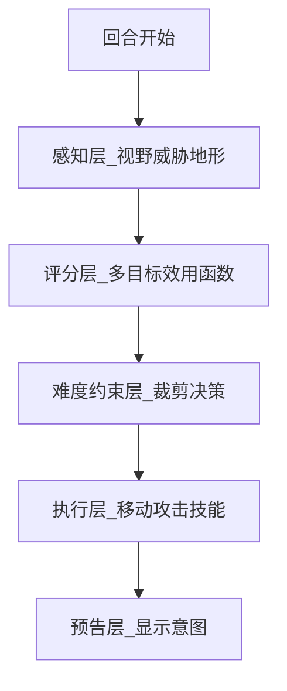

# GDD Template: 纹章残卷：油画纪年

本模板用于锁定 AI 生成整款游戏时的设计边界。所有后续代码、关卡、对话、美术提示词都应引用本文件。

## 1. 项目概述

- 游戏名：纹章残卷：油画纪年
- 类型：2D 回合制战棋
- 引擎：Godot 4.3+
- 目标平台：Web + PC
- 视觉：西方古典油画，中古世纪奇幻
- 游戏规模：第一章 8 关垂直切片，可扩展到 20+ 关
- 核心体验：高信息量战术决策、阵线推进、地形变化、可读但有压迫感的敌人 AI

## 2. 设计支柱

1. 战线不是装饰：单位站位必须影响防御、士气与敌方 AI 目标。
2. 地形会记住战斗：火、冰、毒、雾等效果改变地格，并持续影响接下来 3 回合。
3. 敌人聪明但受约束：难度差异体现在 AI 可用信息、协同能力、预测深度和动作裁剪。
4. 油画感贯穿全局：地图、角色、UI、Shader 与过场都遵循同一套视觉规范。

## 3. 世界观

后纹章战争第 127 年，四个王国以「残卷」碎片维持元素阵线。教会宣称残卷是神授秩序的证明，但古战场上的画布裂隙会展示被抹去的历史。

主角 Elara 是没落贵族后裔。她在灰桥伏击中意外触发残卷，看到先祖并非叛徒，而是被教会献祭的守护者。第一章讲述她夺回圣痕石阵、聚集同伴，并发现 Duke Varen 正在为教会收集残卷。

## 4. 主角与同伴

| 角色 | 初始兵种 | 叙事弧光 | 战斗定位 |
| --- | --- | --- | --- |
| Elara | 刃卫 | 从复仇到守护真相 | 高机动斩杀、领主光环 |
| Kael | 游侠 | 不信任权威到承担传信使命 | 远程、陷阱、地形侦察 |
| Sister Mira | 祭司 | 信仰动摇到重建信仰 | 治疗、结界、圣域 |
| Rowan | 工程兵 | 逃兵到战场建造者 | 修桥、设障、改变地形 |
| Duke Varen | 枪阵军统帅 | 秩序压倒真相 | Boss、防线压迫 |

## 5. 四象阵克制


- 优势倍率：1.2。
- 劣势倍率：0.85。
- 中性倍率：1.0。
- 克制关系必须显示在战斗预览 UI 中。

## 6. 兵种设计

| 兵种 | 元素 | 定位 | 创新机制 |
| --- | --- | --- | --- |
| 枪阵军 | 钢 | 前排控场 | 相邻 2+ 友军时阵线值提升；被包围时崩溃 |
| 刃卫 | 焰 | 高机动突击 | 处决窗口：攻击 HP<30% 敌人可追击 |
| 魔导士 | 焰 | 范围法术 | 以太透支：消耗 HP 强化法术，下回合眩晕 |
| 游侠 | 森 | 远程和陷阱 | 地形共鸣：森林、山地额外移动 |
| 德鲁伊 | 森 | 辅助变形 | 熊、鹰、藤三形态切换 |
| 祭司 | 潮 | 治疗和结界 | 圣域铺设：每关限 2 次无敌区域 |
| 工程兵 | 钢 | 器械和建造 | 战场改造：修桥、设障、破墙 |
| 斥候 | 潮 | 情报和扰乱 | 迷雾穿透：揭示敌方下回合意图 |

## 7. 阵线系统

阵线成立条件：
- 同阵营至少 3 个单位在同一行或同一列连续站位。
- 中间不能有敌方单位或不可通行地形。
- 飞行单位不计入地面阵线。

效果：
- 阵线内单位受到伤害降低 30%。
- 枪阵军额外获得 +10 命中。
- 敌方单位突破阵线时，被突破阵营士气 -1。
- 士气低于 0 时，本回合所有单位命中 -5。

## 8. 创新地形

| 地形 | 规则 | AI 关注点 | 视觉关键词 |
| --- | --- | --- | --- |
| 古战场雾 | 每 3 回合扩散 1 格；命中 -15，暴击 +10 | 高难度会诱导玩家进入雾区 | 暗红笔触、血雾 |
| 圣痕石阵 | 回合开始恢复 5% HP | 普通以上会优先占领 | 金色裂纹、圣痕 |
| 潮汐渠 | 奇数回合干涸，偶数回合不可通行 | 困难以上会卡回合 | 冷蓝反光、泥水 |
| 崩塌城墙 | 范围伤害后变碎石 | 工程兵和 AI 都可利用 | 破碎石灰、烟尘 |
| 契约祭坛 | 占领后召唤一次援军 | 高难度会抢祭坛 | 黑金符文、烛光 |
| 画布裂隙 | 触发剧情闪回或伏兵 | Boss 关核心机制 | 撕裂画布、金线 |

## 9. 地形数据 Schema

```json
{
  "terrain_id": "ancient_battlefield",
  "display_name": "古战场雾",
  "move_cost": { "infantry": 1, "cavalry": 2, "flyer": 1 },
  "defense_mod": 10,
  "hit_mod": 0,
  "avoid_mod": -15,
  "crit_mod": 10,
  "element_affinity": "steel",
  "dynamic_tags": ["blood_mist", "spreading"],
  "elevation": 2,
  "cover_type": "partial",
  "memory_turns": 3,
  "interactive": { "type": "none", "hp": 0, "destructible": false }
}
```

## 10. 敌人 AI

AI 使用 Utility AI。



评分公式：

```text
score = w1*killPotential + w2*objectiveControl + w3*terrainValue
      + w4*formationBreak + w5*survival - w6*riskExposure
```

难度差异：

| 难度 | AI 约束 | 玩家辅助 |
| --- | --- | --- |
| 故事 | 评估前 3 动作；不追击残血；不抢祭坛；不协同 | 伤害预览、撤销移动、完整意图 |
| 普通 | 评估前 8 动作；协同 2 单位；可抢目标点 | 伤害预览、意图图标 |
| 困难 | 评估前 15 动作；协同 3 单位；利用地形记忆 | 危险区 |
| 噩梦 | 不裁剪；预测 2 步；可用透支和地形改造 | 无辅助 |

公式约定：

```text
hit_chance = attacker.hit + weapon.hit - defender.avoid + terrain.hit_mod + terrain.avoid_mod
damage = max(0, attacker.power + weapon.power + element_bonus - defender.defense - terrain.defense_mod)
```

其中 `terrain.avoid_mod` 可为负值；古战场雾使用 `avoid_mod = -15` 表示最终命中降低 15。

## 11. 第一章关卡表

| 关卡 | 类型 | 教学点 | 创新地形 | 剧情节点 |
| --- | --- | --- | --- | --- |
| CH01_L01 灰桥伏击 | 歼灭 | 移动、攻击、克制 | 平原、森林 | Elara 触发残卷 |
| CH01_L02 三旗阵线 | 占旗 | 阵线、支援 | 狭窄桥 | Kael 加入 |
| CH01_L03 圣痕石阵之夜 | 占点 | 恢复地形、抢点 AI | 圣痕石阵 | Mira 动摇 |
| CH01_L04 红雾守夜 | 生存 | 增援、雾区风险 | 古战场雾 | 残卷显示旧战场 |
| CH01_L05 断墙之后 | 护送 | 工程兵、破墙 | 崩塌城墙 | Rowan 加入 |
| CH01_L06 潮汐双路 | 双目标 | 分兵、回合节奏 | 潮汐渠 | 发现祭坛路径 |
| CH01_L07 契约祭坛 | 精英战 | 敌方抢点、召唤 | 契约祭坛 | Varen 现身 |
| CH01_L08 画布裂隙 | Boss | 全机制综合 | 画布裂隙 | 获得第一块残卷 |

## 12. 单关数据模板

```json
{
  "level_id": "CH01_L03",
  "name": "圣痕石阵之夜",
  "objective": "capture",
  "turn_limit": 15,
  "map_size": { "width": 20, "height": 15 },
  "fog_of_war": true,
  "player_units": [
    { "id": "lord_elara", "spawn": [2, 7] },
    { "id": "ranger_kael", "spawn": [2, 8] }
  ],
  "enemy_waves": [
    { "turn": 1, "units": [] },
    { "turn": 5, "reinforcements": { "from": "north_gate", "units": [] } }
  ],
  "terrain_features": [
    { "type": "holy_stone_circle", "positions": [[10, 7]] }
  ],
  "ai_directives": [
    { "priority": "hold_stone_circle" },
    { "personality": "defensive" }
  ],
  "story_beats": {
    "pre_battle": "dialogue_ch01_l03_pre",
    "mid_battle_turn_5": "dialogue_ch01_l03_mid",
    "victory": "dialogue_ch01_l03_victory"
  },
  "rewards": {
    "gold": 500,
    "items": ["iron_lance"],
    "affinity": { "elara_kael": 1 }
  }
}
```

## 13. 对话规则

- 每关战前 3-5 句。
- 每关战中至少 1 个事件台词。
- 每关战后 2-3 句。
- 语言短促、带中古口吻，但避免过度古文。
- 不使用现代网络梗。
- 战斗内不做复杂分支，分支放在 Camp 界面。

## 14. 验收标准

- 第一阶段必须可移动、攻击、结束回合。
- 关卡必须从 JSON 加载。
- AI 难度必须来自 `data/ai/difficulty_profiles.json`。
- 地形效果必须由数据字段驱动。
- 油画风格必须出现在 shader、UI、资产提示词和剧情过场中。
