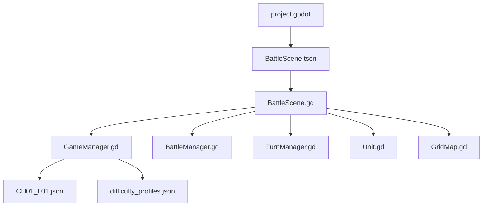

# Technical Design

## 阶段 1 架构

## 文件职责

- `project.godot`：Godot 项目配置、主场景、autoload 注册。
- `autoload/GameManager.gd`：加载关卡与难度 JSON。
- `autoload/BattleManager.gd`：存放阶段 1 的网格尺寸、tile 尺寸和战斗日志信号。
- `autoload/AudioManager.gd`：音频占位，后续阶段接入音效。
- `scripts/battle/BattleScene.gd`：阶段 1 主循环、输入、绘制、占位战斗。
- `scripts/battle/Unit.gd`：单位数据模型与职业默认值。
- `scripts/battle/TurnManager.gd`：回合状态。
- `scripts/map/GridMap.gd`：网格范围、曼哈顿距离、移动范围和占位寻路。
- `scenes/battle/BattleScene.tscn`：最小主场景。

## 输入控制

- 鼠标左键：选择单位、移动、攻击。
- `Enter`：结束玩家回合。
- `Space`：当前选中单位等待。
- `Esc`：取消选择。

## 数据加载

阶段 1 只读取：

- `data/levels/CH01_L01.json`
- `data/ai/difficulty_profiles.json`

`data/units/classes.json` 与 `data/terrains/base_terrains.json` 已提供给后续阶段使用。阶段 1 的职业数值仍在 `Unit.gd` 中作为临时默认值，阶段 2-3 应迁移为完全数据驱动。

## 已知限制

- 阶段 1 没有 TileMapLayer，网格由 `_draw()` 动态绘制。
- 阶段 1 没有完整武器、命中、暴击、经验、升级。
- 敌方 AI 是占位逻辑，不使用 Utility AI。
- 没有保存、Camp、Shader 和正式资产。
