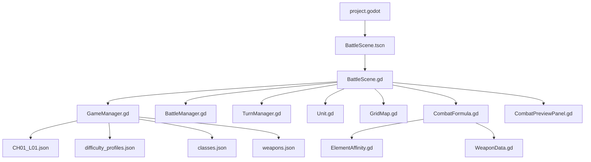

# Technical Design

## 阶段 1 架构

## 文件职责

- `project.godot`：Godot 项目配置、主场景、autoload 注册。
- `autoload/GameManager.gd`：加载关卡与难度 JSON。
- `autoload/BattleManager.gd`：存放阶段 1 的网格尺寸、tile 尺寸和战斗日志信号。
- `autoload/AudioManager.gd`：音频占位，后续阶段接入音效。
- `scripts/battle/BattleScene.gd`：阶段 1 主循环、输入、绘制、占位战斗。
- `scripts/battle/Unit.gd`：单位数据模型、职业数值、经验和升级。
- `scripts/battle/TurnManager.gd`：回合状态。
- `scripts/battle/ElementAffinity.gd`：四象阵克制关系与倍率。
- `scripts/battle/WeaponData.gd`：武器默认值和范围辅助。
- `scripts/battle/CombatFormula.gd`：命中、暴击、伤害、经验奖励字段。
- `scripts/map/GridMap.gd`：网格范围、曼哈顿距离、移动范围和占位寻路。
- `scripts/ui/CombatPreviewPanel.gd`：将战斗预览数据格式化为 HUD 文本。
- `scenes/battle/BattleScene.tscn`：最小主场景。

## 输入控制

- 鼠标左键：选择单位、移动、攻击。
- `Enter`：结束玩家回合。
- `Space`：当前选中单位等待。
- `Esc`：取消选择。

## 数据加载

当前读取：

- `data/levels/CH01_L01.json`
- `data/ai/difficulty_profiles.json`
- `data/units/classes.json`
- `data/units/weapons.json`

`data/terrains/base_terrains.json` 已提供给后续阶段使用。当前战斗公式支持 terrain 参数，但场景还没有把 TileMap 地形传入公式。

## 已知限制

- 阶段 1 没有 TileMapLayer，网格由 `_draw()` 动态绘制。
- 敌方 AI 是占位逻辑，不使用 Utility AI。
- 没有保存、Camp、Shader 和正式资产。
- 地形修正字段已在公式中支持，但阶段 2 的场景仍按默认地形结算。
